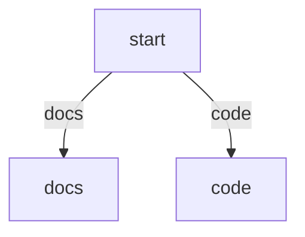

# Markdown-Based Assets

This document is the canonical reference for PocketCoder's Markdown-authored assets.

PocketCoder does not run a second Markdown-specific runtime. Markdown files are authoring inputs that compile into the same prompt, tool, flow, agent-profile, mode, and skill models used elsewhere in the system.

Use this document together with:

- `architecture.md` for startup order and registry behavior
- `configuration.md` for workspace and resource-root paths
- `plugin_architecture.md` for manifest registration and plugin-local resources
- `agent_system.md` for agent-profile semantics
- `modes_and_skills.md` for overlay behavior
- `cli.md` for `/asset` creation, editing, and cloning

## Supported Asset Kinds

PocketCoder currently uses Markdown for these asset surfaces:

| Kind | Current locations | Runtime result |
|------|-------------------|----------------|
| Prompt | plugin `prompts:` files, `<resource_root>/prompts/*.md`, path-based prompt includes | prompt text plus source tracking |
| Tool | manifest `tools: foo: tools/foo.md`, `<resource_root>/tools/*.md` | wrapped executable tool metadata plus Python handler |
| Flow | manifest `flows.<name>.markdown`, manifest `.md` `source`, `<resource_root>/flows/*.md` | `FlowDefinition` with either a loaded PocketFlow factory or generated graph `flow_instance` |
| Agent profile | `<plugin>/agents/*.md`, `<resource_root>/agents/*.md` | `CompositeAgent` / agent profile |
| Mode | `<resource_root>/modes/*.md` | `ModeDefinition` |
| Skill | `<resource_root>/skills/<name>/SKILL.md` | `SkillDefinition` |

Markdown-backed assets participate in the same registries and precedence rules as YAML manifests and Python factories.

## Common Syntax

Most Markdown assets support three content layers:

1. YAML front matter for structured fields
2. fenced blocks for typed structured sections
3. Markdown body text for prompts or descriptions

### YAML front matter

Front matter must be a YAML mapping.

Example:

```md
---
name: review
flow: core.react
tools:
  - core.read_file
---
Review changes conservatively.
```

### Fenced blocks

The Markdown asset parser recognizes named fenced blocks such as:

- `yaml spec`
- `yaml flow`
- `yaml tool`
- `yaml agent`
- `yaml profile`
- `yaml config`
- `yaml schema`
- `mermaid`
- `mermaid graph`
- `dot`

Current behavior:

- YAML blocks whose label matches the asset type are deep-merged into front matter
- `yaml schema` is used by Markdown tools for the tool input schema
- `mermaid` and `dot` blocks are preserved as graph metadata for Markdown flows
- fenced `markdown`, `md`, and `text` blocks may contribute prompt or description text when the asset kind supports it

### Markdown body text

The meaning of the body depends on asset kind:

- prompts: the whole file is prompt text
- tools: description text when no explicit `description` field is set
- flows: prompt text merged into the flow prompt bundle
- agent profiles: `inline_prompt`
- modes: inline mode prompt overlay
- skills: inline skill guidance text

## Includes And Prompt Imports

Markdown prompt expansion is handled by the shared prompt loader.

Supported directives:

- `{{ include:path/to/file.md }}`
- `{{ import:prompt:plugin.prompt_name }}`
- `{{ import:prompt:resource_root.pocketcode.review }}`

Current rules:

- includes are resolved relative to the source file first
- path-based fallback resolution then searches the active prompt fallback directories
- when a fallback prompt directory is passed, PocketCoder also checks that directory's parent so documented paths such as `prompts/review.md` resolve correctly from a resource root
- prompt imports resolve through the live prompt registry
- nested includes are allowed
- include cycles are rejected

Examples:

```md
{{ include:shared/reviewing.md }}
{{ import:prompt:core.system }}
{{ import:prompt:resource_root.pocketcode.review }}
```

## Prompt Assets

Prompt files are plain Markdown prompt sources. They can be:

- registered explicitly through plugin manifests under `prompts:`
- auto-registered from `<resource_root>/prompts/`
- loaded indirectly as path-based prompt files from flows, agents, modes, or skills

Prompt files support nested `include` and registry-backed `import` expansion.

Direct prompt registrations use canonical registry names such as:

- `core.system`
- `resource_root.pocketcode.review`
- `workspace.review` for the default `.pocketcode/` compatibility namespace

When a path-based prompt source is loaded, PocketCoder records the contributing source files so runtime prompt provenance remains visible on the compiled flow definition.

## Markdown Tool Assets

Markdown tool files describe tool metadata, but they do not replace Python execution.

The Markdown file provides:

- `name`
- `description`
- `handler`
- `schema`
- `execution_mode`
- `timeout_seconds`

The underlying executable implementation still comes from the required `handler` field.

Current supported handler forms are:

- `path.py:ObjectName`
- `module.ObjectName`

Example:

````md
---
name: workspace_echo
handler: ./workspace_echo.py:WorkspaceEchoTool
description: Echo text back to the caller.
execution_mode: inline
---

```yaml schema
type: object
properties:
  text:
    type: string
required:
  - text
```
````

Current runtime behavior:

- the Markdown definition is compiled into metadata first
- the handler is resolved through the same loader used for manifest Python tool references
- the runtime wraps the loaded handler with the Markdown description, schema, execution mode, timeout, and source path metadata
- `tool_runtime` reports the Markdown source path when the tool came from a Markdown asset

Current validation behavior:

- tool authoring rejects missing handler files
- tool authoring rejects missing handler objects
- tool authoring rejects invalid import-path handlers
- Markdown `include` and `import` directives inside tool files are expanded and validated before reload

## Markdown Flow Assets

Markdown flows compile into ordinary `FlowDefinition` objects.

### Two supported flow forms

1. Python factory flow: the Markdown file supplies `module` and `entry_fn`
2. generated graph flow: the Markdown file omits `module` and `entry_fn` but includes graph metadata plus a `nodes:` mapping

Example Python-backed Markdown flow:

````md
---
name: planner
module: planner.py
entry_fn: create_flow
llm_profile: fast
tools:
  - core.read_file
prompt_files:
  - prompts/review.md
---
Plan carefully.
````

Example generated graph flow:

````md
---
name: triage
nodes:
  start:
    kind: route
    transition_key: requested_path
  docs:
    kind: output
    message: Review the docs first.
  code:
    kind: output
    message: Review the code first.
---


````

### Flow prompt behavior

Markdown flow prompt content can come from:

- inline body text
- `system_prompt` or `prompt`
- `system_prompt_file` or `prompt_file`
- `prompt_files`
- `prompts` as a compatibility alias
- `prompt:` resource references anywhere a prompt file reference is accepted

The loader resolves those through the shared prompt bundle path and stores the resulting `system_prompt` and `prompt_sources` on the compiled `FlowDefinition`.

### Generated graph flow behavior

Generated Mermaid and DOT graph flows are intentionally narrow and deterministic.

Current supported node kinds are:

- `route` / `branch` / `decision`
- `noop` / `pass` / `set`
- `tool`
- `handoff`
- `output` / `end` / `answer` / `ask`

Current graph node capabilities include:

- exact value lookup such as `$shared.user.name`
- string interpolation such as `${shared.user.name}`
- moustache interpolation such as `{{ shared.user.name }}`
- fixed transitions
- route-key lookup with optional transition maps
- tool success, failure, and result-based branching
- copying values from tool results back into shared state with `store`

Current terminal shared-store keys used by generated graph flows include:

- `_tool_runtime`
- `pending_handoff_agent`
- `final_answer`
- `question_to_ask`
- `results`
- `last_tool_result`
- `error_message`

Current graph edge behavior:

- unlabeled edge means transition `default`
- labeled Mermaid or DOT edge means that exact transition label

Current graph validation rejects:

- unknown node kinds
- nodes declared in `nodes:` but missing from the graph
- static transitions that do not have a matching outgoing edge
- tool nodes without a `tool`
- handoff nodes without a target agent

## Markdown Agent Profiles

Markdown agent profiles compile into the same `CompositeAgent` model used by YAML agent profiles.

Current supported front matter keys mirror the agent profile schema:

- `name`
- `flow`
- `description`
- `llm_profile`
- `skills`
- `tools`
- `extra_prompts`
- `tool_confirmation`

Current body behavior:

- the Markdown body becomes `inline_prompt`
- `include` and `import` directives are expanded before profile creation

Current load and save behavior:

- plugin-local profiles can live in `agents/*.yaml` or `agents/*.md`
- workspace profiles can live in `<resource_root>/agents/*.yaml` or `<resource_root>/agents/*.md`
- saving a Markdown-backed workspace profile preserves Markdown format instead of rewriting to YAML
- cloning a Markdown-backed workspace profile preserves the `.md` extension

Current validation behavior:

- agent `flow` refs are normalized and validated against the live flow registry before reload for workspace Markdown edits and clones
- explicit `tools` refs are validated against the live tool registry before reload
- `prompt:` entries in `extra_prompts` are validated against the live prompt registry before reload
- path-based `extra_prompts` are loaded and validated through the shared prompt loader before reload

## Markdown Modes

Modes are always Markdown files loaded from `<resource_root>/modes/*.md`.

The mode body is inline guidance appended after the base agent profile prompt. Front matter selects or overrides:

- `flow`
- `agent`
- `llm_profile`
- `tools`
- `extra_prompts`
- `tool_confirmation`

Current load-time validation behavior:

- `mode.flow` must resolve against the live flow registry when a flow registry is available
- `mode.agent` must resolve against the live agent-profile registry when that lookup is available
- `tools` entries must resolve against the live tool registry
- `prompt:` entries and path-based prompt files in `extra_prompts` must resolve during mode load

Modes that fail those checks are skipped instead of remaining partially loaded.

## Markdown Skills

Skills are rooted at `<resource_root>/skills/<skill_name>/` and require `SKILL.md`.

The Markdown file contributes:

- skill metadata from front matter
- inline guidance from the body
- `tools` references to already-registered tools
- `extra_prompts`

Skill directories may also contain:

- `tools/*.py` for skill-local Python tools
- `references/`
- `assets/`
- `scripts/`

Current load-time validation behavior:

- referenced `tools` must resolve against the live tool registry
- `prompt:` entries in `extra_prompts` must resolve against the prompt registry
- path-based prompt files in `extra_prompts` must load successfully from the skill root plus prompt fallback dirs

## Workspace Authoring And Editing

Workspace Markdown assets are managed through the shared engine asset API.

Current `/asset` support covers:

- `agent`
- `flow`
- `tool`

Current CLI operations are:

- create
- list
- show
- clone
- edit
- delete

Current Textual UI support covers:

- editing workspace Markdown flow and tool assets
- cloning workspace Markdown flow and tool assets
- deleting workspace Markdown flow and tool assets

Workspace Markdown asset editing and cloning validates the asset before reload so broken references fail during authoring rather than surfacing only during a later startup.

## Validation Timeline

Markdown assets currently validate at three different stages:

1. parse and compile time: front matter shape, YAML block shape, include and import expansion
2. load or authoring time: live-registry and file-path validation for the specific asset kind
3. narrow engine post-load normalization: contextual rebinding and canonicalization that still depend on the fully populated runtime state

This means:

- malformed Markdown assets are rejected while loading
- workspace Markdown edits and clones fail before reload when they point at missing handlers, prompts, tools, or flows
- mode and skill overlays are skipped before they become selectable when their static refs are invalid

## Canonical References

The most relevant implementation files are:

- `pocketcode/core/markdown_assets.py`
- `pocketcode/core/markdown_graph_flow.py`
- `pocketcode/core/prompt_loader.py`
- `pocketcode/core/plugin_manager.py`
- `pocketcode/core/agent_profile_manager.py`
- `pocketcode/core/markdown_profiles.py`
- `pocketcode/core/engine.py`
