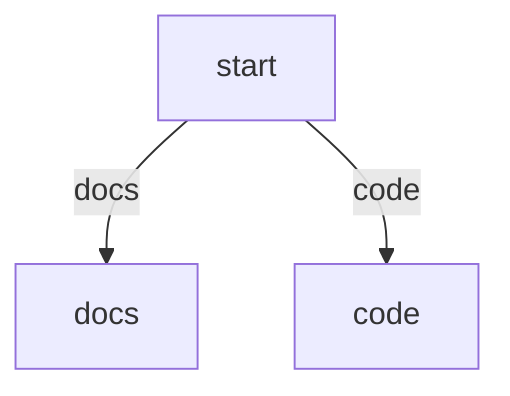

# Markdown-Based Assets

This document is the canonical reference for PocketCoder's Markdown-authored assets.

PocketCoder does not run a second Markdown-specific runtime. Markdown files are authoring inputs that compile into the same prompt, tool, flow, agent-profile, mode, and skill models used elsewhere in the system.

Use this document together with:

- `architecture.md` for startup order and registry behavior
- `configuration.md` for workspace and resource-root paths
- `plugin_architecture.md` for manifest registration and plugin-local resources
- `agent_system.md` for agent-profile semantics
- `modes_and_skills.md` for overlay behavior
- `cli.md` for `/asset` creation, editing, and cloning

## Supported Asset Kinds

PocketCoder currently uses Markdown for these asset surfaces:

| Kind | Current locations | Runtime result |
|------|-------------------|----------------|
| Prompt | plugin `prompts:` files, `<resource_root>/prompts/*.md`, path-based prompt includes | prompt text plus source tracking |
| Tool | manifest `tools: foo: tools/foo.md`, `<resource_root>/tools/*.md` | wrapped executable tool metadata plus Python handler |
| Flow | manifest `flows.<name>.markdown`, manifest `.md` `source`, `<resource_root>/flows/*.md` | `FlowDefinition` with either a loaded PocketFlow factory, generated graph `flow_instance`, or StackVM program source |
| Agent profile | `<plugin>/agents/*.md`, `<resource_root>/agents/*.md` | `CompositeAgent` / agent profile |
| Mode | `<resource_root>/modes/*.md` | `ModeDefinition` |
| Skill | `<resource_root>/skills/<name>/SKILL.md` | `SkillDefinition` |

Markdown-backed assets participate in the same registries and precedence rules as YAML manifests and Python factories.

## Common Syntax

Most Markdown assets support three content layers:

1. YAML front matter for structured fields
2. fenced blocks for typed structured sections
3. Markdown body text for prompts or descriptions

### YAML front matter

Front matter must be a YAML mapping.

Example:

```md
---
name: review
flow: core.react
tools:
  - core.read_file
---
Review changes conservatively.
```

### Fenced blocks

The Markdown asset parser recognizes named fenced blocks such as:

- `yaml spec`
- `yaml flow`
- `yaml tool`
- `yaml agent`
- `yaml profile`
- `yaml config`
- `yaml schema`
- `mermaid`
- `mermaid graph`
- `dot`

Current behavior:

- YAML blocks whose label matches the asset type are deep-merged into front matter
- `yaml schema` is used by Markdown tools for the tool input schema
- `mermaid` and `dot` blocks are preserved as graph metadata for Markdown flows
- fenced `markdown`, `md`, and `text` blocks may contribute prompt or description text when the asset kind supports it

### Markdown body text

The meaning of the body depends on asset kind:

- prompts: the whole file is prompt text
- tools: description text when no explicit `description` field is set
- flows: prompt text merged into the flow prompt bundle
- agent profiles: `inline_prompt`
- modes: inline mode prompt overlay
- skills: inline skill guidance text

## Includes And Prompt Imports

Markdown prompt expansion is handled by the shared prompt loader.

Supported directives:

- `{{ include:path/to/file.md }}`
- `{{ import:prompt:plugin.prompt_name }}`
- `{{ import:prompt:resource_root.pocketcode.review }}`

Current rules:

- includes are resolved relative to the source file first
- path-based fallback resolution then searches the active prompt fallback directories
- when a fallback prompt directory is passed, PocketCoder also checks that directory's parent so documented paths such as `prompts/review.md` resolve correctly from a resource root
- prompt imports resolve through the live prompt registry
- nested includes are allowed
- include cycles are rejected

Examples:

```md
{{ include:shared/reviewing.md }}
{{ import:prompt:core.system }}
{{ import:prompt:resource_root.pocketcode.review }}
```

## Prompt Assets

Prompt files are plain Markdown prompt sources. They can be:

- registered explicitly through plugin manifests under `prompts:`
- auto-registered from `<resource_root>/prompts/`
- loaded indirectly as path-based prompt files from flows, agents, modes, or skills

Prompt files support nested `include` and registry-backed `import` expansion.

Direct prompt registrations use canonical registry names such as:

- `core.system`
- `resource_root.pocketcode.review`
- `workspace.review` for the default `.pocketcode/` compatibility namespace

When a path-based prompt source is loaded, PocketCoder records the contributing source files so runtime prompt provenance remains visible on the compiled flow definition.

## Markdown Tool Assets

Markdown tool files describe tool metadata, but they do not replace Python execution.

The Markdown file provides:

- `name`
- `description`
- `handler`
- `schema`
- `execution_mode`
- `timeout_seconds`

The underlying executable implementation still comes from the required `handler` field.

Current supported handler forms are:

- `path.py:ObjectName`
- `module.ObjectName`

Example:

````md
---
name: workspace_echo
handler: ./workspace_echo.py:WorkspaceEchoTool
description: Echo text back to the caller.
execution_mode: inline
---

```yaml schema
type: object
properties:
  text:
    type: string
required:
  - text
```
````

Current runtime behavior:

- the Markdown definition is compiled into metadata first
- the handler is resolved through the same loader used for manifest Python tool references
- the runtime wraps the loaded handler with the Markdown description, schema, execution mode, timeout, and source path metadata
- `tool_runtime` reports the Markdown source path when the tool came from a Markdown asset

Current validation behavior:

- tool authoring rejects missing handler files
- tool authoring rejects missing handler objects
- tool authoring rejects invalid import-path handlers
- Markdown `include` and `import` directives inside tool files are expanded and validated before reload

## Markdown Flow Assets

Markdown flows compile into ordinary `FlowDefinition` objects.

### Supported flow forms

1. Python factory flow: the Markdown file supplies `module` and `entry_fn`
2. generated graph flow: the Markdown file omits `module` and `entry_fn` but includes graph metadata plus a `nodes:` mapping
3. StackVM flow: the Markdown file includes one or more fenced `vm` or `stackvm` blocks, or explicit `vm_*` fields in front matter

Example Python-backed Markdown flow:

````md
---
name: planner
module: planner.py
entry_fn: create_flow
llm_profile: fast
tools:
  - core.read_file
prompt_files:
  - prompts/review.md
---
Plan carefully.
````

Example generated graph flow:

````md
---
name: triage
nodes:
  start:
    kind: route
    transition_key: requested_path
  docs:
    kind: output
    message: Review the docs first.
  code:
    kind: output
    message: Review the code first.
---


````

Example StackVM-backed Markdown flow:

````md
---
name: vm_triage
llm_profile: fast
vm_entry: decide
vm_modules:
  - vm/common
vm_files:
  - vm/tail.md
---

```vm
[ request "request_text" store-set ] "capture-request" define
[ "request_text" store-get "Route request: " swap concat answer ] "decide" define
```
````

Example companion files:

`vm/common.vm`

```text
[ request "request_text" store-set ] "capture-request" define
```

`vm/tail.md`

````md
```vm
[ "tail loaded" "tail_status" store-set ] "tail-init" define
```
````

### Flow prompt behavior

Markdown flow prompt content can come from:

- inline body text
- `system_prompt` or `prompt`
- `system_prompt_file` or `prompt_file`
- `prompt_files`
- `prompts` as a compatibility alias
- `prompt:` resource references anywhere a prompt file reference is accepted

The loader resolves those through the shared prompt bundle path and stores the resulting `system_prompt` and `prompt_sources` on the compiled `FlowDefinition`.

### StackVM flow behavior

StackVM-backed flows are still normal `FlowDefinition` records. They use `execution_mode: vm` and carry VM-specific fields such as:

- `vm_source`
- `vm_entry`
- `vm_module`, `vm_modules`
- `vm_file`, `vm_files`

Current source loading rules:

- fenced `vm` and `stackvm` blocks are concatenated into `vm_source`
- `vm_module` and `vm_modules` resolve module-like refs such as `vm/common` or `vm.common`
- `vm_file` and `vm_files` resolve explicit `.vm` or `.md` files relative to the flow file or resource/plugin roots
- Markdown module files contribute fenced `vm`/`stackvm` blocks when present, otherwise their body text is used as VM source
- standalone `.vm` source files use `!` for line comments; the same `!` convention applies inside fenced `vm` and `stackvm` blocks
- runtime loading currently assembles VM source in `pocketcode/core/stackvm_loader.py`, parses it in `pocketcode/core/stackvm_parser.py`, collects non-fatal authoring warnings plus executable-AST validation in `pocketcode/core/stackvm_validator.py`, expands compile-time macros in `pocketcode/core/stackvm_expander.py`, and then executes the resulting AST through `AgentStackVM`

Current compile-time macro behavior:

For the canonical macro reference, including syntax examples and builtin macro guidance, see `stackvm_macros.md`.

- `defmacro` is available as a compile-time StackVM form with postfix shape `"[ params ] [ template ] \"name\" defmacro"`
- macro parameters must be symbols listed in the parameter quotation
- legacy macro templates are expanded by AST substitution rather than raw string replacement
- macro invocations use ordinary postfix StackVM syntax and consume the required number of immediately preceding syntax arguments
- quotations can be passed as syntax arguments and substituted into macro templates
- `syntax-quote` is currently available in postfix form for macro definitions as `"[ params ] [ template ] syntax-quote \"name\" defmacro"`
- inside syntax-quoted templates, `[ name unquote ]` inserts one syntax argument and `[ name unquote-splice ]` splices a quotation/list syntax argument into the surrounding template list
- inside syntax-quoted templates, `[ "prefix" gensym ]` produces a fresh symbol node such as `__prefix_1` during expansion
- the current built-in macro library is loaded automatically and includes `when`, `unless`, `shared-or`, `tool-once`, `delegate-return`, `finalize-from`, and `prompt-route`
- built-in macros that need multi-step expressions, such as `tool-once` and `prompt-route`, currently expect those expressions to be passed as quotations and execute them with `call` after expansion
- `delegate-return` currently handles the common “handoff when no delegated result exists, otherwise answer from a result path” branch shape, but it does not set `pending_handoff_policy` automatically
- `examples/stackvm_delegate_return_plugin/` is the checked-in reference for using `delegate-return` together with explicit `pending_handoff_policy` setup
- `examples/stackvm_macro_authoring_plugin/` is the checked-in reference for user-authored `defmacro` plus `syntax-quote` usage
- `last_vm_validation_warnings` currently surfaces non-fatal source-level authoring warnings such as the legacy manual `last-tool-result none? ... tool-request ... if` loop and direct `prompt-interaction ... switch` exact-match routing, which should normally be replaced by `tool-once` and `prompt-route`
- macro expansion errors now retain an ordered macro trace so nested failures can identify the expansion path that led to the error
- current macro support is still intentionally limited: there is not yet a richer compile-time evaluator, source-map reporting, or hygienic binding system beyond generated symbol names

Current runtime debug fields for VM flows:

- `last_vm_source` stores the combined pre-expansion StackVM source string
- `last_vm_expanded_source` stores a normalized serialized form of the expanded executable AST
- `last_vm_expansion_metadata` currently includes `expansion_count`, `macro_names`, `builtin_macro_names`, `gensym_count`, and the ordered `expansion_trace`
- `last_vm_validation_warnings` records non-fatal source-level authoring warnings collected before macro expansion, including an exact source-derived `location` such as `line 12, cols 1-48` plus a structured `span` payload with `start_line`, `start_column`, `end_line`, and `end_column` when the original VM source is available
- `last_vm_sources` continues to store the resolved module/file source paths that contributed to the loaded program

Current runtime host words provided by the engine include:

- `answer`
- `ask-user`
- `prompt-user`
- `prompt-interaction`
- `handoff`
- `tool-request`
- `transition`
- `llm-call`
- `system-prompt`
- `llm-profile`
- `tool-definitions`
- `request`
- `last-tool-result`
- `last-tool-route`
- `results`

Selected built-in stack/runtime helpers currently available include:

- `stack-depth`, `stack-empty?`
- `can-pop?`, `can-dup?`, `can-swap?`, `can-over?`
- `yaml>`
- `int>`, `float>`, `bool>`, `str>`
- `shared@`, `shared!`, `shared!?`
- `none?`
- `success?`, `failure?`
- `dict-get`, `dict-set`
- `dict-get?`
- `list-get`, `list-set`
- `list-get?`
- `get-in`, `get-in?`, `set-in`, `set-in?`
- `keys`, `values`
- `list-append`
- `len`, `empty?`, `contains?`
- `join`
- `switch`, `cond`, `fallback`, `parallel-map`, `reduce`
- `+`, `-`, `*`, `/`
- `>`, `<`, `>=`, `<=`

Current mutation convention:

- `store-set` expects the key on top of the stack and the value beneath it, for example `request "request_text" store-set`
- `shared!` follows the same shape for dotted shared-store paths, for example `"done" "results.status" shared!`
- `shared!?` follows the same value-then-path shape but returns `None` instead of raising when the path is invalid; on success it pushes the mutated shared store
- numeric path segments are treated as list indices in `get-in`, `set-in`, `shared@`, and `shared!`, for example `"meta.items.1.name" get-in` or `"ok" "results.reviews.0.status" shared!`
- `set-in` mutates an arbitrary dict/list container using the same key-on-top shape, for example `dup "done" "meta.steps.0.status" set-in`

Current stack-safety helpers:

- `stack-depth` reports the current stack size without mutating the stack
- `stack-empty?` reports whether the stack is empty
- `can-pop?` and `can-dup?` report whether at least one item is available
- `can-swap?` and `can-over?` report whether at least two items are available
- these guard words are non-destructive, so they can be used ahead of `dup`, `drop`, `swap`, and `over` when authoring defensive StackVM flows

Current conversion helpers:

- `int>` coerces the top stack value to an integer using Python-style numeric parsing
- `float>` coerces the top stack value to a floating-point number
- `bool>` accepts booleans, numbers, `None`, and common string forms such as `true`, `false`, `yes`, `no`, `1`, and `0`
- `bool>` raises an error for ambiguous strings instead of silently guessing
- `str>` stringifies the top stack value without changing any surrounding stack state

Current collection helpers:

- `list-get` expects a list beneath an integer index and pushes the selected item
- `list-get?` returns `None` instead of raising when the container is not a list, the index is not an integer, or the index is out of range
- `list-set` expects a list beneath an integer index and a replacement value, mutates the list, and pushes the updated list
- `dict-get?` returns `None` instead of raising when the container is not a dict
- `get-in?` returns `None` instead of raising when the path itself is invalid; missing nested keys and out-of-range list segments still resolve to `None` under both `get-in` and `get-in?`
- `set-in?` returns `None` instead of raising when the container or path is invalid; on success it mutates the container and pushes the updated value
- `dict-get`, `dict-set`, `list-get`, and `list-set` all follow the existing key-or-index-on-top convention used elsewhere in the VM

Current formatting helpers:

- `concat` concatenates two values after stringifying them
- `str>` stringifies the top stack value directly
- `join` expects a list or tuple beneath a separator and joins the items after stringifying them, for example `dup ", " join`
- `join` is useful when `prompt-interaction` returns checklist selections and the flow needs readable output instead of Python-style list formatting

Current orchestration combinators:

- `switch` expects a target value beneath a quotation of alternating case/action pairs and executes the first exact-match action, otherwise the optional `"default"` action
- `cond` expects a quotation of alternating condition/action pairs, evaluates each condition quotation from top to bottom, and executes the first truthy action quotation
- `fallback` expects primary and fallback quotations; it executes the fallback quotation only when the primary quotation raises during VM evaluation, and it restores the stack snapshot taken before the primary quotation started
- `parallel-map` expects a list or tuple beneath a quotation and returns a single list containing one result per input item
- `parallel-map` runs each item in an isolated child VM with the parent's built-ins and user-defined words plus a cloned shared-store snapshot, so child `shared!` and `store-set` mutations do not leak back to the parent flow
- `parallel-map` is intended for pure data transforms and LLM calls rather than tool requests, handoffs, questions, or answers
- `reduce` expects a list or tuple beneath an initial accumulator and a quotation; for each item it runs the quotation in an isolated child VM with the accumulator beneath the current item and uses the top stack value as the next accumulator
- `reduce` also uses a cloned shared-store snapshot per child step, so shared-store mutations inside the reducer do not flow back to the parent run
- `reduce` is intended for pure fan-in over already loaded data and rejects tool requests, handoffs, questions, and answers inside child quotations

StackVM flows execute against the same shared-store contract used by other flows, so they can populate `pending_tool`, `pending_handoff_agent`, `final_answer`, `question_to_ask`, and other runtime-managed keys.

Current VM `llm-call` behavior:

- `llm-call` composes the active VM system prompt with the prompt on top of the stack and pushes the model response text back onto the stack
- `llm-call` updates `last_llm_generation`, `last_llm_profile`, `llm_usage_totals`, `llm_cost_usd_total`, and `llm_calls` using the shared `LlmRouter` generation metadata
- `llm-call` emits the same `llm_call_started` and `llm_call_completed` runtime events used by the standard LLM-agent path

Current interactive input semantics:

- `ask-user` is terminal and sets `question_to_ask`, which the runtime surfaces as `Question: ...`
- `prompt-user` is continuing and requires `interaction_handler` or `user_input_handler` in the shared store
- `prompt-user` stores `last_user_prompt`, `last_user_interaction`, and `last_user_input`, and pushes the response text back onto the VM stack
- `prompt-user` is intended for bridged runs such as `PocketCodeEngine.start_request(..., bridge_user_input=True)`
- `prompt-interaction` is the generic continuing host word for structured interaction requests such as `buttons`, `radio`, and `checklist`
- `prompt-interaction` accepts either a mapping or a YAML mapping string on top of the stack
- `prompt-interaction` stores `last_user_request`, `last_user_prompt`, `last_user_interaction`, and `last_user_value`, then pushes the extracted response value onto the VM stack
- for `checklist`, `prompt-interaction` pushes the selected value list; for `buttons` and `radio`, it pushes the selected scalar value

Current optional runtime key rules:

- use `shared@` when branching on optional runtime-managed keys that may be absent, such as `last_delegated_result`, because it resolves missing paths to `None`
- `store-get` is still appropriate for required top-level scratch values written by the same VM flow, but it returns the empty string for missing keys
- if a branch depends on `none?`, prefer `shared@` over `store-get` for runtime-managed keys
- `last_delegated_result`, `last_tool_result`, and nested shared-state contracts are safest to read through `shared@`, `get-in`, or `get-in?`

Tool execution failures reported as `{"success": false, ...}` remain available to the flow in `last_tool_result` and `last_tool_route`. They do not abort execution automatically, which allows StackVM flows to branch on `failure?` and recover explicitly.

### Generated graph flow behavior

Generated Mermaid and DOT graph flows are intentionally narrow and deterministic.

Current supported node kinds are:

- `route` / `branch` / `decision`
- `noop` / `pass` / `set`
- `tool`
- `handoff`
- `output` / `end` / `answer` / `ask`

Current graph node capabilities include:

- exact value lookup such as `$shared.user.name`
- string interpolation such as `${shared.user.name}`
- moustache interpolation such as `{{ shared.user.name }}`
- fixed transitions
- route-key lookup with optional transition maps
- tool success, failure, and result-based branching
- copying values from tool results back into shared state with `store`

Current terminal shared-store keys used by generated graph flows include:

- `_tool_runtime`
- `pending_handoff_agent`
- `final_answer`
- `question_to_ask`
- `results`
- `last_tool_result`
- `error_message`

Current graph edge behavior:

- unlabeled edge means transition `default`
- labeled Mermaid or DOT edge means that exact transition label

Current graph validation rejects:

- unknown node kinds
- nodes declared in `nodes:` but missing from the graph
- static transitions that do not have a matching outgoing edge
- tool nodes without a `tool`
- handoff nodes without a target agent

## Markdown Agent Profiles

Markdown agent profiles compile into the same `CompositeAgent` model used by YAML agent profiles.

Current supported front matter keys mirror the agent profile schema:

- `name`
- `flow`
- `description`
- `llm_profile`
- `skills`
- `tools`
- `extra_prompts`
- `tool_confirmation`

Current body behavior:

- the Markdown body becomes `inline_prompt`
- `include` and `import` directives are expanded before profile creation

Current load and save behavior:

- plugin-local profiles can live in `agents/*.yaml` or `agents/*.md`
- workspace profiles can live in `<resource_root>/agents/*.yaml` or `<resource_root>/agents/*.md`
- saving a Markdown-backed workspace profile preserves Markdown format instead of rewriting to YAML
- cloning a Markdown-backed workspace profile preserves the `.md` extension

Current validation behavior:

- agent `flow` refs are normalized and validated against the live flow registry before reload for workspace Markdown edits and clones
- explicit `tools` refs are validated against the live tool registry before reload
- `prompt:` entries in `extra_prompts` are validated against the live prompt registry before reload
- path-based `extra_prompts` are loaded and validated through the shared prompt loader before reload

## Markdown Modes

Modes are always Markdown files loaded from `<resource_root>/modes/*.md`.

The mode body is inline guidance appended after the base agent profile prompt. Front matter selects or overrides:

- `flow`
- `agent`
- `llm_profile`
- `tools`
- `extra_prompts`
- `tool_confirmation`

Current load-time validation behavior:

- `mode.flow` must resolve against the live flow registry when a flow registry is available
- `mode.agent` must resolve against the live agent-profile registry when that lookup is available
- `tools` entries must resolve against the live tool registry
- `prompt:` entries and path-based prompt files in `extra_prompts` must resolve during mode load

Modes that fail those checks are skipped instead of remaining partially loaded.

## Markdown Skills

Skills are rooted at `<resource_root>/skills/<skill_name>/` and require `SKILL.md`.

The Markdown file contributes:

- skill metadata from front matter
- inline guidance from the body
- `tools` references to already-registered tools
- `extra_prompts`

Skill directories may also contain:

- `tools/*.py` for skill-local Python tools
- `references/`
- `assets/`
- `scripts/`

Current load-time validation behavior:

- referenced `tools` must resolve against the live tool registry
- `prompt:` entries in `extra_prompts` must resolve against the prompt registry
- path-based prompt files in `extra_prompts` must load successfully from the skill root plus prompt fallback dirs

## Workspace Authoring And Editing

Workspace Markdown assets are managed through the shared engine asset API.

Current `/asset` support covers:

- `agent`
- `flow`
- `tool`

Current CLI operations are:

- create
- list
- show
- clone
- edit
- delete

Current Textual UI support covers:

- editing workspace Markdown flow and tool assets
- cloning workspace Markdown flow and tool assets
- deleting workspace Markdown flow and tool assets

Workspace Markdown asset editing and cloning validates the asset before reload so broken references fail during authoring rather than surfacing only during a later startup.

## Validation Timeline

Markdown assets currently validate at three different stages:

1. parse and compile time: front matter shape, YAML block shape, include and import expansion
2. load or authoring time: live-registry and file-path validation for the specific asset kind
3. narrow engine post-load normalization: contextual rebinding and canonicalization that still depend on the fully populated runtime state

This means:

- malformed Markdown assets are rejected while loading
- workspace Markdown edits and clones fail before reload when they point at missing handlers, prompts, tools, or flows
- mode and skill overlays are skipped before they become selectable when their static refs are invalid

## Canonical References

The most relevant implementation files are:

- `pocketcode/core/markdown_assets.py`
- `pocketcode/core/markdown_graph_flow.py`
- `pocketcode/core/prompt_loader.py`
- `pocketcode/core/plugin_manager.py`
- `pocketcode/core/agent_profile_manager.py`
- `pocketcode/core/markdown_profiles.py`
- `pocketcode/core/engine.py`
