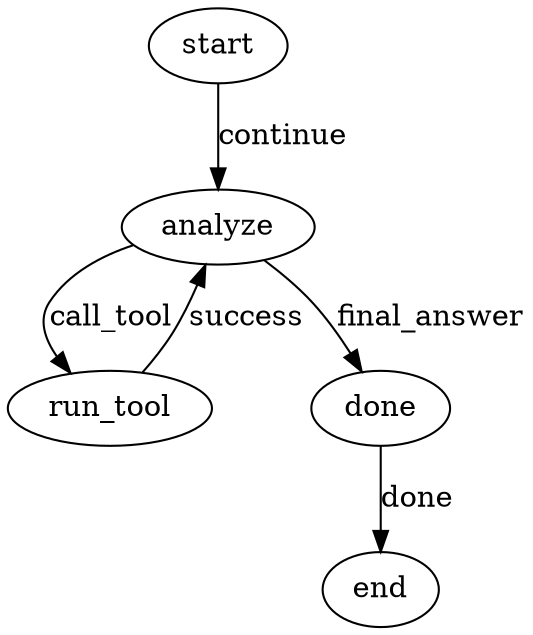

# Pocketcode Plugin Architecture

Pocketcode loads tools plus unified `components` (agents and flows) from `plugin.yaml`.
Agents are the primary composition unit in the CLI/runtime; flows are internal execution graphs that agents can use.

## Layout

```text
my-plugin/
  plugin.yaml
  workflows/
    my_flow.md
  prompts/
    agents/
      planner.md
    flows/
      my_flow.md
    nodes/
      analyze.md
    shared/
      rules.md
  nodes/
    hooks.py
  flows/
    custom_flow.py
```

## Manifest

```yaml
name: my_plugin

tools:
  read_file: pocketcode.tools.filesystem.ReadFileTool

components:
  planner:
    kind: agent
    llm_profile: gemini_fast
    execution_mode: node
    tools: [read_file]
    prompt_file: prompts/agents/planner.md
    handoff_agents: [coder]
    pre:
      - nodes/hooks.py:before_planner_turn
    post:
      - nodes/hooks.py:after_planner_turn
    default_handoff_policy:
      context_mode: whole
      return_to_caller: false
    handoff_policies:
      coder:
        context_mode: delegated
        return_to_caller: true
        return_transition: continue

node_definitions:
  analyze_step:
    kind: agent
    agent: planner
    prompt_file: prompts/nodes/analyze.md
    pre:
      - nodes/hooks.py:before_analyze
    post:
      - nodes/hooks.py:after_analyze

node_handlers:
  summarize: nodes/custom_nodes.py:run_summarize_node

  graph_flow:
    kind: workflow
    path: workflows/graph_flow.md
  custom_flow:
    kind: workflow
    ref: flows/custom_flow.py:run_custom_flow
    default_agent: planner
    prompt_file: prompts/flows/custom_flow.md
    pre:
      - nodes/hooks.py:before_custom_flow
```

## Graph Workflow Markdown

Workflow files are Markdown with front matter plus a `dot` graph block.

````markdown
---
name: graph_flow
start: start
default_agent: planner
prompt_file: prompts/flows/graph_flow.md
pre:
  - nodes/hooks.py:before_flow
post:
  - nodes/hooks.py:after_flow
nodes:
  analyze:
    use: analyze_step
---


````

## Supported Built-In Node Kinds

- `start`
- `agent`
- `tool`
- `handoff`
- `flow` (composite; runs another workflow by name)
- `python`
- `output`
- `end`
- `noop`

`kind="agent"` nodes can execute in two patterns based on agent config:

- `execution_mode: node` (default): standard LLM/tool/handoff loop.
- `execution_mode: flow` with `flow: <workflow_name>`: composite agent that runs a nested workflow.

For `python` nodes:

- `handler: path/to/file.py:run` (default is `nodes/<node_id>.py:run`)
- optional `pre`, `steps`, `post` hooks

All node kinds can attach Python hooks:

- `pre`: run before core node logic
- `steps`: run during node execution
- `post`: run after core node logic

Handlers may return:

- `"<transition>"`
- `{ transition: "...", updates: {...}, halt: true|false }`

## Runtime Execution Model

Graph workflows are compiled into PocketFlow `Node` objects at runtime and used as internal execution graphs.

- Each node kind maps to a dedicated runtime node executor (`agent`, `tool`, `handoff`, `flow`, `python`, `output`, `end`, `start`, `noop`).
- Hook phases (`pre`, `steps`, `post`) are handled consistently by a shared hooked-node base class before and after each node's core behavior.
- Tool execution and agent decisions are still routed through the main workflow runtime, but node-kind dispatch is now class-based instead of one monolithic node dispatcher.
- Agents also support their own hook phases (`pre`, `steps`, `post`) and can independently choose `execution_mode: node|flow`.

## Agent Handoff Policies

Agent config supports policy-based handoffs:

- `default_handoff_policy`: baseline policy for all handoffs from that agent.
- `handoff_policies.<target_agent>`: per-target overrides.

Supported policy fields:

- `return_to_caller: true|false`
- `context_mode: whole|delegated`
- `context`: optional static delegated context payload
- `return_transition`: transition label used when returning to caller
- `handoff_transition`: transition label emitted from the handoff node

At decision time, agents can also emit `handoff_policy` and `context` in the YAML response to override policy/context for that handoff.

## Flow Composition

Use `kind="flow"` with `flow="<workflow_name>"` to nest flows. Nested flows can themselves contain other `flow` nodes.

## Prompt Files + Include Convention

Prompt fields can point to external Markdown:

- `prompt_file`
- `prompt_files`

Include shared prompt fragments with:

```text
{{ include:../shared/rules.md }}
```

Includes are resolved relative to the current file and support nested includes.

## Compatibility

Legacy `agents:` and `workflows:` sections are still supported, but `components:` is the unified format.

## Runtime Introspection

Use the CLI to inspect loaded unified definitions:

- `/list components` lists all loaded components (agents + workflows) with kind and source.
- `/list agents` shows the active selectable runtime units.
- `/list workflows` is retained for compatibility but workflow selection is internal.
- `/confirm` manages session-level tool confirmation overrides.
- `/set llm-agent`, `/set llm-node`, and `/set llm-handoff` manage session LLM override routing.

Legacy aliases (`/components`, `/agents`, `/workflows`, `/workflow`, `/mode`, `/llm-agent`, `/llm-node`, `/llm-handoff`) remain supported.

Textual interactive shortcuts:

- `Tab`: complete current prompt input
- `Ctrl+]`: select next agent
- `Ctrl+[`: select next global LLM override
- `Ctrl+T`: toggle top stats panel
- `Ctrl+Space`: complete current prompt input
- `Ctrl+Shift+A`: copy full response console output
- `Ctrl+Y`: copy last assistant response
- `Ctrl+Q`: quit Textual UI

Output box behavior:

- output text is selectable with mouse/keyboard
- copy selected text with your terminal copy shortcut (for example `Ctrl+Shift+C`)

Textual copy commands:

- `/copy`
- `/copy-all`

## LLM Routing Overrides

Agents can use different LLM profiles across nodes, nested sub-flows, and handoffs.

Config supports runtime LLM overrides:

```yaml
runtime:
  llm_overrides:
    agents:
      planner: gemini_default
    nodes:
      graph_flow.analyze: gemini_fast
      analyze: gemini_fast
    handoffs:
      planner->coder: gemini_fast
      planner:
        reviewer: gemini_default
```

Optional usage cost estimation config:

```yaml
runtime:
  llm_pricing:
    gemini-2.5-flash:
      input_per_1k: 0.000075
      output_per_1k: 0.00030
```

Node keys may be `workflow.node` (recommended) or bare `node` (fallback).

Resolution precedence (highest first):

1. CLI node override (`/llm-node`)
2. config node override
3. CLI agent override (`/llm-agent`)
4. config agent override
5. CLI global override (`/llm`)
6. dynamic handoff/agent choice from previous turn
7. node attribute `llm_profile`
8. agent `llm_profile`
9. `llm.default_profile`

## Tool Confirmation Policy

Tool execution policy supports three modes:

- `allow`: execute tool without confirmation
- `confirm`: ask for interactive user confirmation first
- `deny`: reject execution

Policy resolution order is most-specific-first, including session overrides:

1. session agent+tool override (`/confirm agent-tool ...`)
2. config agent+tool override
3. session tool override (`/confirm tool ...`)
4. session agent default (`/confirm agent ...`)
5. config agent default
6. config global tool override
7. session default (`/confirm session ...`)
8. config global default (`runtime.tool_confirmation.default_policy`)

Example config:

```yaml
runtime:
  tool_confirmation:
    default_policy: confirm
    tool_policies:
      execute_command: confirm
    agent_policies:
      Coder:
        default_policy: confirm
        tool_policies:
          git_push: deny
```

## Workspace Extensions

Workspace plugin paths are configured in `./pocketcode.yml`:

```yaml
runtime:
  plugin_paths:
    - .pocketcode/plugins
```

Drop plugin folders there and run `/reload` in the CLI.
