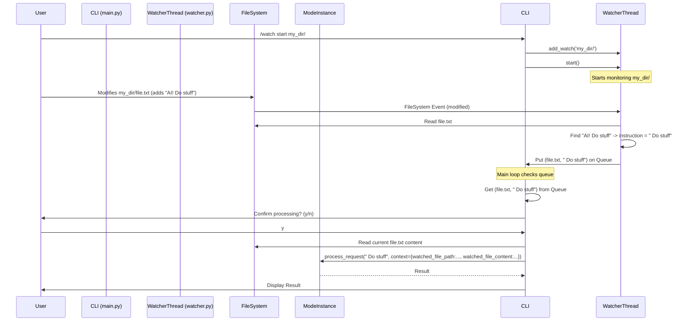

# Watch Mode Implementation Plan (V1)

**Goal:** Implement a file watching mechanism that triggers mode execution based on a specific string in changed files.

**Core Components:**

1.  **Configuration (`pocketcode/config/settings.yaml`):**
    *   Add a new top-level section `watch_mode:`
        *   `enabled_by_default`: `false` (boolean) - Watcher doesn't start automatically, requires `/watch start`.
        *   `trigger_string`: `"AI!"` (string) - The string to detect in changed files.
        *   `instruction_source`: `after_trigger` (enum: `after_trigger` or `full_line`) - Determines if the instruction is the text after the trigger or the whole line.
        *   `ask_confirmation`: `true` (boolean) - Whether to ask the user before processing a detected instruction.
        *   `watch_recursive`: `true` (boolean) - Whether directories added via `/watch start` should be watched recursively.
        *   `queue_changes`: `true` (boolean) - If multiple changes are detected quickly, queue them or process only the latest? (True = queue).

2.  **File Monitoring (New Module: `pocketcode/core/watcher.py`):**
    *   Use the `watchdog` library (needs to be added to `requirements.txt`).
    *   Create a `FileWatcher` class that runs in a separate thread.
    *   It will maintain a set of watched paths (`watched_paths`).
    *   It will have methods like `start()`, `stop()`, `add_watch(path)`, `remove_watch(path)`.
    *   When a file modification event occurs for a watched path:
        *   Read the file content.
        *   Scan lines for the `trigger_string` (from config).
        *   If found, extract the instruction based on `instruction_source` (from config).
        *   Place the detected event (file path, instruction string, timestamp) onto a thread-safe queue (e.g., `queue.Queue`).

3.  **Main Application Integration (`pocketcode/main.py`):**
    *   **Initialization:** Create an instance of `FileWatcher` and the instruction queue.
    *   **Command Handling (`handle_command`):**
        *   Add `/watch start <path1> [path2...]`: Adds paths to `FileWatcher.watched_paths`. Starts the watcher thread if not already running. Respects `watch_recursive` config.
        *   Add `/watch stop [path1] [path2...]`: Removes paths from `FileWatcher.watched_paths`. If no paths given, clears all watches and stops the watcher thread.
        *   Add `/watch status`: Displays if the watcher thread is running and lists `FileWatcher.watched_paths`.
    *   **Main Loop Modification:**
        *   Make the main loop non-blocking or check the instruction queue periodically (e.g., using `queue.get_nowait()`). *Initial approach: Check queue before prompting.*
        *   If an instruction is found in the queue:
            *   Get the file path and instruction text.
            *   If `ask_confirmation` is true: Prompt user: "Detected 'AI!' instruction in `{filepath}`: '{instruction}'. Process? (y/n)". If 'n', discard.
            *   If processing:
                *   Read the *current* content of the file (`filepath`).
                *   Prepare a temporary context dictionary: `watch_context = {"watched_file_path": filepath, "watched_file_content": file_content}`.
                *   Combine with existing `cli_context`.
                *   Call `current_mode_instance.process_request(instruction, combined_context)`.
                *   Print the result.
                *   Handle potential errors during processing.

4.  **Dependencies (`requirements.txt`):**
    *   Add `watchdog`.

**Diagram (Conceptual Flow):**

**Key Considerations & Trade-offs:**

*   **Main Loop Blocking:** The biggest challenge is integrating the asynchronous watcher with the synchronous `input()` loop. Checking the queue between prompts is simplest but means instructions are only processed when the user *could* enter input. A fully non-blocking UI would be more complex.
*   **Error Handling:** Need robust error handling for file reading, queue operations, and mode processing triggered by the watcher.
*   **Concurrency Details:** The `queue.Queue` handles basic queuing. More complex logic (debouncing, handling rapid changes) could be added later if needed.