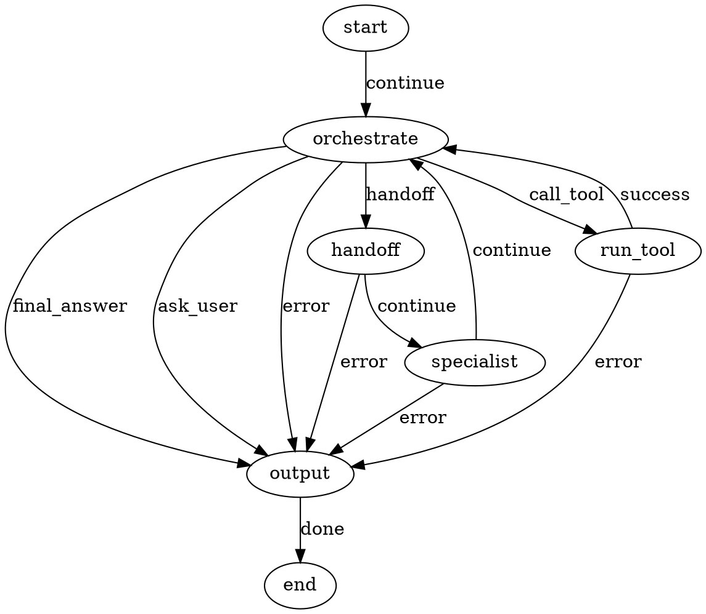

```dot
digraph orchestrator {
  start [kind="start"];
  orchestrate [kind="agent" agent="micromanager"];
  handoff [kind="handoff"];
  specialist [kind="flow" flow="single_agent"];
  run_tool [kind="tool"];
  output [kind="output"];
  end [kind="end"];

  start -> orchestrate [label="continue"];

  orchestrate -> run_tool [label="call_tool"];
  orchestrate -> handoff [label="handoff"];
  orchestrate -> output [label="final_answer"];
  orchestrate -> output [label="ask_user"];
  orchestrate -> output [label="error"];

  run_tool -> orchestrate [label="success"];
  run_tool -> output [label="error"];

  handoff -> specialist [label="continue"];
  handoff -> output [label="error"];

  specialist -> orchestrate [label="continue"];
  specialist -> output [label="error"];

  output -> end [label="done"];
}
```
