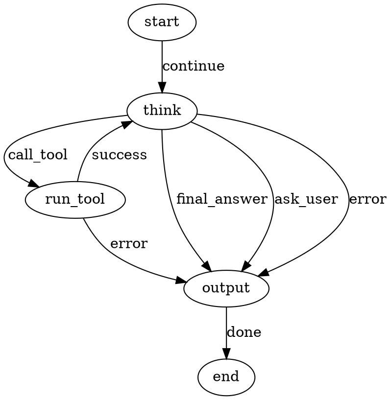

```dot
digraph single_agent {
  start [kind="start"];
  think [kind="agent"];
  run_tool [kind="tool"];
  output [kind="output"];
  end [kind="end"];

  start -> think [label="continue"];

  think -> run_tool [label="call_tool"];
  think -> output [label="final_answer"];
  think -> output [label="ask_user"];
  think -> output [label="error"];

  run_tool -> think [label="success"];
  run_tool -> output [label="error"];

  output -> end [label="done"];
}
```
