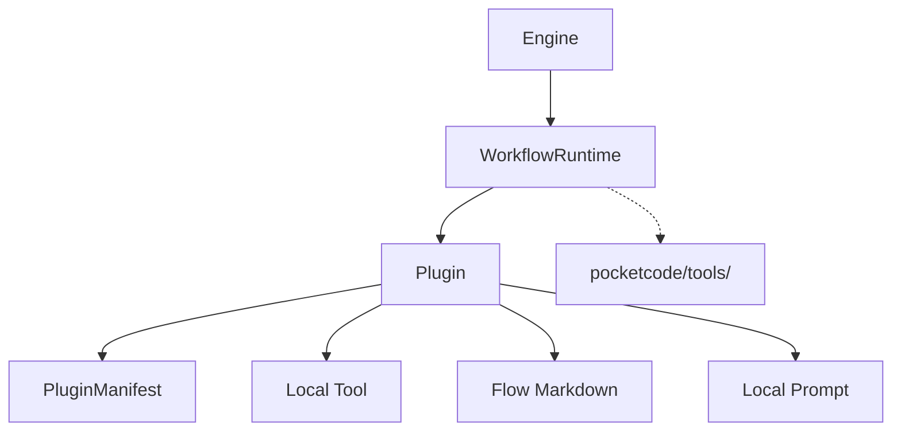

# Data Model: Refactor Plugin Structure and Composition

**Feature**: [spec.md](./spec.md) | **Plan**: [plan.md](./plan.md)

## Entities

### `AgentManifest` (`agent.yaml`)

- **name** (string): Unique identifier for the agent.
- **description** (string): Friendly description for user-facing documentation.
- **version** (string): Semantic version.
- **tools** (list of objects): Scoped tools provided by this agent.
  - **id** (string): Unique ID within the agent.
  - **handler** (string): Path to Python class/function (e.g., `tools/myscript.py:MyTool`).
- **workflows** (list of objects): Scoped workflows provided by this agent.
  - **id** (string): Unique ID within the agent.
  - **file** (string): Path to markdown flow definition (e.g., `workflows/flow.md`).
- **prompts** (list of strings): Paths to local prompt fragments.

### `WorkflowRuntime` (Adapter)

- **engine** (`pocketflow.Flow`): The underlying orchestration implementation.
- **scope** (string): The active plugin context for asset resolution.

## Relationships

## Validation Rules

- **Unique IDs**: Plugin names must be unique within the `plugins/` folder.
- **Asset Resolution**: All local `handler` and `file` paths must resolve relative to the plugin's root.
- **Fallback Rule**: When a workflow requests a tool ID, the runtime MUST search `Plugin.tools` before `pocketcode.tools`.
